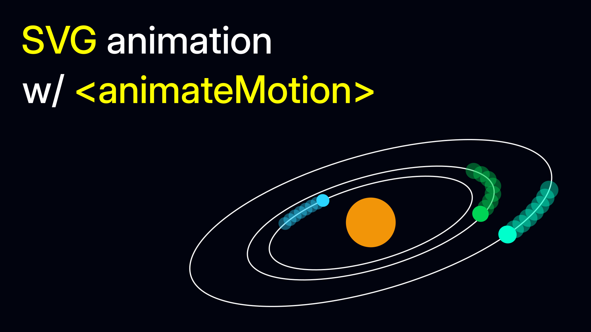

# AnimateMotion



A simple way to make an object follow a path in SVG using the `animateMotion` element. This project shows how to animate planets orbiting around a star.

## Live demo

Try it out here: [https://imadsaddik.github.io/AnimateMotion/](https://imadsaddik.github.io/AnimateMotion/)

https://github.com/user-attachments/assets/0cdb3052-d750-4348-8876-445137642338

Watch my YouTube tutorial on how to create this animation: [Animate SVGs with the animateMotion tag](https://youtu.be/-CGtL2ay7Fw)

## Installation

This is a Vue.js project, so make sure that you have installed Vue. Here is a link to the [Vue.js documentation](https://vuejs.org/guide/quick-start.html) for more information.

Also make sure to install `pnpm` if you haven't already, as it is used to manage the dependencies in this project. Check out the [pnpm documentation](https://pnpm.io/installation) for installation instructions.

After you have installed Vue and pnpm, you can clone this repository:

```bash
git clone https://github.com/ImadSaddik/AnimateMotion.git
cd AnimateMotion
```

Then, install the dependencies:

```bash
pnpm install
```

Now you can run the development server:

```bash
pnpm run serve
```

You can now open your browser and navigate to `http://localhost:8080/AnimateMotion/` to see the animation in action.

## License

This project is licensed under the [MIT License](LICENSE).

## Contributions

We welcome contributions! If you find any issues or have suggestions for improvements, please open an issue or submit a pull request.

## Need help?

You can reach me through:  

- **LinkedIn** – [Connect with me](https://www.linkedin.com/in/imadsaddik/).  
- **Email** – [simad3647@gmail.com](mailto:simad3647@gmail.com).
